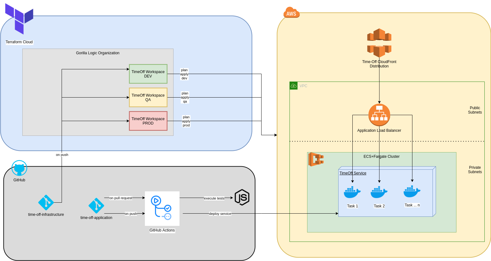

# TimeOff.Management

Web application for managing employee absences.


## Architecture

In the following diagram you can see:
 
 * Global Architecture in AWS Cloud
 * Deployment Strategy of application using Github And Github Actions
 * Infrastructure deployment using Github + Terraform + Terraform Cloud   




CloudFront URL to access to TimeOff Management:  https://d9cjju6z589xo.cloudfront.net/login/

NOTE: At this moment there is only one environment mounted in AWS (prod) But in the future we are going to implement all the needed environments. 

### Self hosting

Install TimeOff.Management application within your infrastructure:

(make sure you have Node.js (>=4.0.0) and SQLite installed)

```bash
git clone https://github.com/blazart/timeoff-management-application.git timeoff-management
cd timeoff-management
npm install
npm start
```
Open http://localhost:3000/ in your browser.

## Run tests

We have quite a wide test coverage, to make sure that the main user paths work as expected.

Please run them frequently while developing the project.

Make sure you have Chrome driver installed in your path and Chrome browser for your platform.

If you want to see the browser execute the interactions prefix with `SHOW_CHROME=1`

```bash
USE_CHROME=1 npm test
```

(make sure that application with default settings is up and running)

Any bug fixes or enhancements should have good test coverage to get them into "master" branch.

## Updating existing instance with new code

In case one needs to patch existing instance of TimeOff.Managenent application with new version:

```bash
git fetch
git pull origin master
npm install
npm run-script db-update
npm start
```

## Feedback

This is a fork of https://github.com/timeoff-management/timeoff-management-application, if you have feedback or you want to contribute please do it at that repository. 

