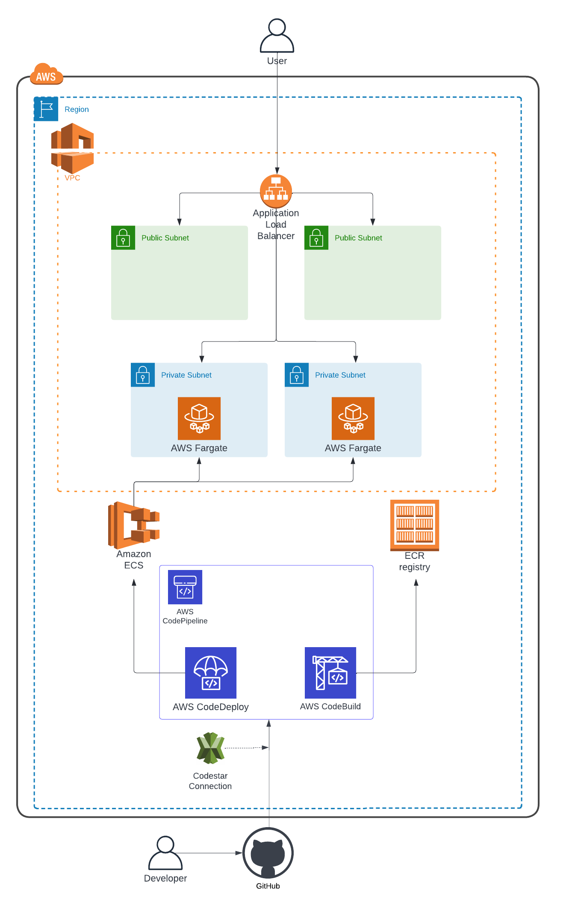

# TimeOff.Management

Web application for managing employee absences.

<a href="https://travis-ci.org/timeoff-management/timeoff-management-application"></a>


# Some notes for this project

Here are some details on the solution implemented with this application:

* **Cloud provider**: AWS
* **IaC solution**: Terraform
* **Container orchestration service**: ECS 
* **CI/CD Pipeline**: GitHub, AWS CodeBuild, AWS CodeDeploy and AWS CodePipeline

Here you can see a diagram describing the different services used to run this application:


As shown in the diagram, the application sits behind an AWS Application Load Balancer and is higly available thanks to the Elastic Container Service and runs on Fargate instances as containers. These containers are located under the VPC's private subnets so the actual application is protected and only reachable via the load balancer.

Every time a commit is pushed to the develop branch, a build process will start using AWS CodeBuild and this service will push the containerized image to a private ECR Repository. Once the new image is pushed, this will trigger a deployment via AWS CodeDeploy, in this case we are leveraging a canary deployment using Codedeploy.
 
The application is currently accesible via the following addresses (one with HTTPS support from my understanding of application requirements)
* https://timeoff-app.dereedere.link:444/login/
* http://timeoff-app.dereedere.link/login/

An /infrastructure in the repositoy's branch subfolder holds all the Terraform configuration files used. Additionally, the configuration has some rough modularization to set the tone for reusable configuration hopefully in the future, either via workspaces or module usage.

Below are some generic details about changes made to the application and the infrastructure:

*Changes*
- Removed multicontainer from Dockerfile
- Change on sqllite3 version - pined to 5.0.0
- Change on node-sass version - upgraded to "^5.0.0" due to unsupported compatibility with gyp and python3


*Recomendations*
- Pin version of source image
- Use public-ecr or private-ecr-repository to prevent rate limiting without  requiring Docker Hub Authentication


## Features

**Multiple views of staff absences**

Calendar view, Team view, or Just plain list.

**Tune application to fit into your company policy**

Add custom absence types: Sickness, Maternity, Working from home, Birthday etc. Define if each uses vacation allowance.

Optionally limit the amount of days employees can take for each Leave type. E.g. no more than 10 Sick days per year.

Setup public holidays as well as company specific days off.

Group employees by departments: bring your organisational structure, set the supervisor for every department.

Customisable working schedule for company and individuals.

**Third Party Calendar Integration**

Broadcast employee whereabouts into external calendar providers: MS Outlook, Google Calendar, and iCal.

Create calendar feeds for individuals, departments or entire company.

**Three Steps Workflow**

Employee requests time off or revokes existing one.

Supervisor gets email notification and decides about upcoming employee absence.

Absence is accounted. Peers are informed via team view or calendar feeds.

**Access control**

There are following types of users: employees, supervisors, and administrators.

Optional LDAP authentication: configure application to use your LDAP server for user authentication.

**Ability to extract leave data into CSV**

Ability to back up entire company leave data into CSV file. So it could be used in any spreadsheet applications.

**Works on mobile phones**

The most used customer paths are mobile friendly:

* employee is able to request new leave from mobile device

* supervisor is able to record decision from the mobile as well.

**Lots of other little things that would make life easier**

Manually adjust employee allowances
e.g. employee has extra day in lieu.

Upon creation employee receives pro-rated vacation allowance, depending on start date.

Email notification to all involved parties.

Optionally allow employees to see the time off information of entire company regardless of department structure.

## Screenshots


## Installation

### Cloud hosting

Visit http://timeoff.management/

Create company account and use cloud based version.

### Self hosting

Install TimeOff.Management application within your infrastructure:

(make sure you have Node.js (>=4.0.0) and SQLite installed)

```bash
git clone https://github.com/timeoff-management/application.git timeoff-management
cd timeoff-management
npm install
npm start
```
Open http://localhost:3000/ in your browser.

## Run tests

We have quite a wide test coverage, to make sure that the main user paths work as expected.

Please run them frequently while developing the project.

Make sure you have Chrome driver installed in your path and Chrome browser for your platform.

If you want to see the browser execute the interactions prefix with `SHOW_CHROME=1`

```bash
USE_CHROME=1 npm test
```

(make sure that application with default settings is up and running)

Any bug fixes or enhancements should have good test coverage to get them into "master" branch.

## Updating existing instance with new code

In case one needs to patch existing instance of TimeOff.Managenent application with new version:

```bash
git fetch
git pull origin master
npm install
npm run-script db-update
npm start
```

## How to?

There are some customizations available.

## How to amend or extend colours available for colour picker?
Follow instructions on [this page](docs/extend_colors_for_leave_type.md).

## Customization

There are few options to configure an installation.

### Make sorting sensitive to particular locale

Given the software could be installed for company with employees with non-English names there might be a need to
respect the alphabet while sorting customer entered content.

For that purpose the application config file has `locale_code_for_sorting` entry.
By default the value is `en` (English). One can override it with other locales such as `cs`, `fr`, `de` etc.

### Force employees to pick type each time new leave is booked

Some organizations require employees to explicitly pick the type of leave when booking time off. So employee makes a choice rather than relying on default settings.
That reduce number of "mistaken" leaves, which are cancelled after.

In order to force employee to explicitly pick the leave type of the booked time off, change `is_force_to_explicitly_select_type_when_requesting_new_leave`
flag to be `true` in the `config/app.json` file.

## Use Redis as a sessions storage

Follow instructions on [this page](docs/SessionStoreInRedis.md).

## Feedback

Please report any issues or feedback to <a href="https://twitter.com/FreeTimeOffApp">twitter</a> or Email: pavlo at timeoff.management

